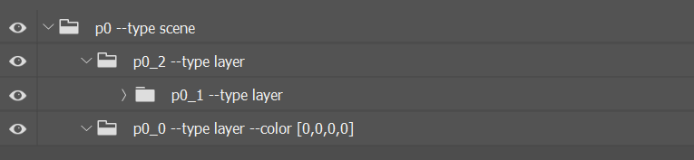
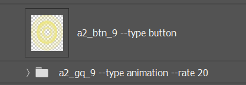
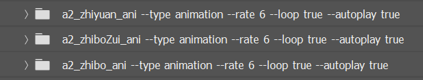
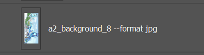

# 图层处理部分
## 1、长图psd目录结构示意图
 

### --type scene
表示最外层容器，其他所有的长图图层内容都放置于这个容器中，代码框架中也是根据这个scene来进行UI部分的页面适配 
### --type layer
上图中的*p0_0 --type layer*为一个透明的空白浮层，作为滑动浮层使用 
而*p0_2 --type layer*则是放置内容的图层文件，代表这个文件内的所有图层均处于同一页面上，长图项目则主要就为这一页。 

## 2、长图部分图层命名规范示意图与详解

### --type button
按钮相关的图层需要在文件名后面加上*--type button* 

### --type animation
帧动画的文件组名需要在名字后面加上*--type animation*
* #### --rate (number)
rate后面的数字则是控制一秒内显示的图片数量，rate后面跟的数字越大，帧动画播放越快；反之，越慢
* #### --loop true/false
loop后面的true或者false则代表帧动画是否需要循环播放，true为循环播放，false则为只播放一次
* #### --autoplay true/false
autoplay后面的true/false则代表的是帧动画是否需要自动播放，true为自动播放，false则为需要通过事件触发 

### --format jpg
长图的背景需要被分割成若干个不大于2048长度的小背景，而每个背景后面则需要加上--format jpg 
